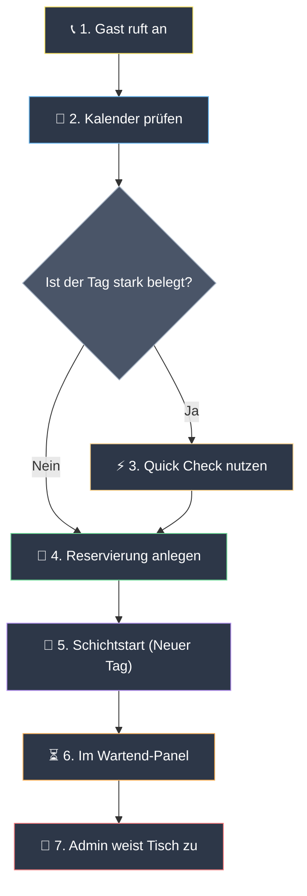

# PoolSports Reservierungen — Handbuch für Mitarbeitende

Willkommen im PoolSports-Reservierungssystem. Dieses Handbuch erklärt den täglichen Arbeitsablauf chronologisch – vom Schichtbeginn bis zur Steuerung der Live-Tische.[file:46]

> [!IMPORTANT]
> **Umgebung:** Läuft lokal auf den Computern im Betrieb über das lokale WLAN-Netzwerk.[file:46]

---

## 🔑 1. Benutzerrollen & Login

Deine Berechtigungen hängen von deiner PIN ab.[file:46]

* **Staff (Mitarbeiter):** Kann Reservierungen über Quick Check anlegen, den Kalender einsehen, Walk‑Ins setzen und Tische freigeben. Mitarbeitende sehen die **Agenda** (Nur-Lesen-Liste mit den heutigen Buchungen).[file:46]
* **Admin (Schichtleitung):** Vollständige Kontrolle. Kann die Schicht starten, Tische über das **Wartend-Panel** zuweisen, Tische sperren ("Defekt" / "Repariert"), CSV‑Backups hochladen und zugewiesene Reservierungen zurück ins Wartend-Panel senden.[file:46]

---

## 🔄 2. Vollständiger Reservierungs‑Workflow

Im Folgenden siehst du den Lebenszyklus einer Reservierung – vom Moment des Anrufs bis zur Tischzuweisung.[file:46]

---

## 📞 3. Reservierungen annehmen (Quick Check)

Wenn ein Gast anruft, nutze **Verfügbarkeit prüfen** (Quick Check), um die Kapazität zu prüfen.[file:46]

1. **Details eingeben:** Datum, Start‑/Endzeit (oder Open End), Spielart, Tischanzahl und Standort auswählen.[file:46]
2. **Prüfen:** Auf "Verfügbarkeit prüfen" klicken.[file:46]
3. **Verfügbar (Grün):** Name, Telefon, Personenanzahl und Bemerkungen eintragen. Auf "Reservierung erstellen" klicken.[file:46]
4. **Nicht verfügbar (Rot):** Das System warnt mit "Keine ausreichende Kapazität". Über einen der vorgeschlagenen **"Nächste freie Zeiten"** auf einen freien Slot springen.[file:46]

> [!NOTE]
> **Mehrere Standorte:** Wenn du für eine Reservierung mehrere Standorte auswählst, wird sie nicht einem konkreten Standort zugeordnet. Standardmäßig werden nicht zugeordnete Reservierungen dem **EG** zugewiesen.[file:46]

---

## 📅 4. Kalender prüfen

Der Kalender bietet eine visuelle Übersicht aller zukünftigen Buchungen pro Tag.[file:46]

* **Ansicht:** Auf ein Datum klicken, um das Tagespanel zu öffnen und die Reservierungen dieses Tages anzuzeigen.[file:46]
* **Überbuchungswarnungen:** Das System **blockiert** dich nicht technisch davor, eine überlappende Reservierung auf denselben Tisch zu legen. Wenn eine Überbuchung entsteht, markiert das System den Fehler mit einem orangefarbenen Warnrahmen. Diese Warnungen dürfen nicht ignoriert werden.[file:46]

---

## 🎱 5. Live-Dashboard (Schichtbetrieb)

Im Live-Dashboard steuerst du die Echtzeit‑Tischzustände.[file:46]

### Ansichten
* **🗺️ Floor Plan (Visuell):** Zeigt die physische Tisch‑Anordnung.[file:46]
* **📋 Listenansicht (Tabellenansicht):** Vertikale Tabellenliste mit erweiterten Filtern (Spielart, Status, Standort, Open End).[file:46]
  * **Datenbank‑Recovery (Admin):** Hier können Admins auch eine **CSV‑Datei hochladen**, um das System wiederherzustellen, falls die Datenbank beschädigt wird.[file:46]

### Seitenpanels
* **Agenda (Staff):** Nur-Lesen‑Liste mit allen Reservierungen des aktuellen Tages.[file:46]
* **Wartend-Panel (Admin):** Zeigt eingehende Reservierungen ohne feste Tischzuordnung. Admins können diese per Drag‑and‑Drop auf physische Tische ziehen und nach Standort sowie Spielart filtern.[file:46]

### Tischstatus‑Farben

| Icon | Status | Bedeutung |
| :---: | :--- | :--- |
| 🟢 | **Frei (Grün)** | Tisch ist komplett frei. |
| 🟡 | **Reserviert (Gelb)** | Für einen kommenden Gast gebucht. |
| 🔴 | **Belegt (Rot)** | Aktuell bespielt (Timer läuft). |
| 🔵 | **Belegt + Res. (Blau)** | Belegt, aber eine Reservierung folgt als Nächstes. |
| ⚫ | **Defekt (Grau)** | Gesperrt/defekt (nur Admin). |

### Sitz‑Aktionen
Über einen Klick auf einen Tisch öffnest du sein Steuerfenster:[file:46]
- **Walk‑In 👥:** (Grüner Tisch) Gast sofort setzen.[file:46]
- **Walk‑In vergeben bis [Zeit]:** (Gelber Tisch) Walk‑In nur bis zur reservierten Zeit setzen.[file:46]
- **Belegt ✅:** Reservierten Gast setzen; der Timer startet sofort.[file:46]
- **Tisch freigeben:** Tisch nach Bezahlung freimachen.[file:46]
- **No‑Show ❌:** Nicht erschienene Reservierung stornieren.[file:46]
- **Undo ↩:** Fehlklick rückgängig machen.[file:46]
- **Zurück zu Wartend:** (nur Admin) Eine zugewiesene Reservierung ins Wartend‑Panel zurückschicken.[file:46]

---

## 🚨 6. Troubleshooting

* **Start.bat‑Fenster:** Das schwarze `start.bat`‑Fenster auf dem Haupt‑PC nicht schließen. Wenn das Dashboard einfriert oder offline geht, Haupt‑PC prüfen, `start.bat` doppelklicken (falls geschlossen) und das Tablet neu laden.[file:46]
